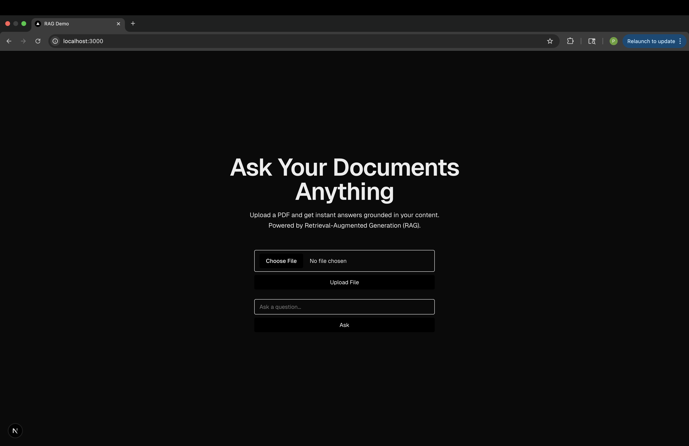
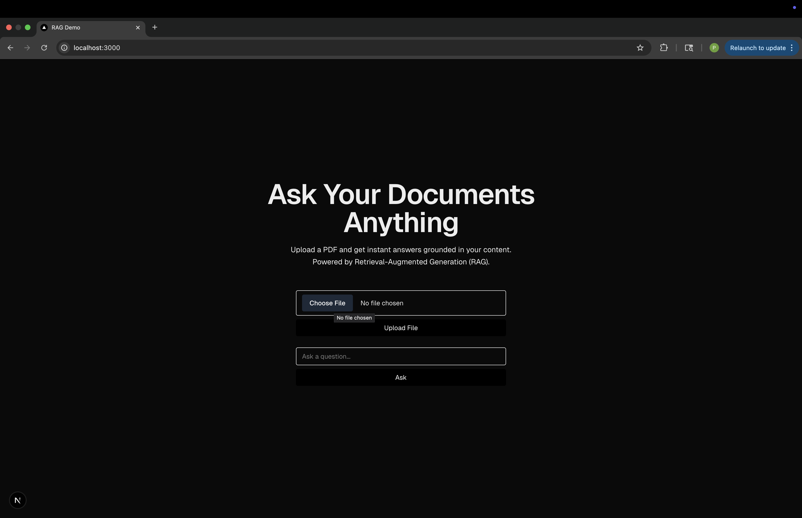
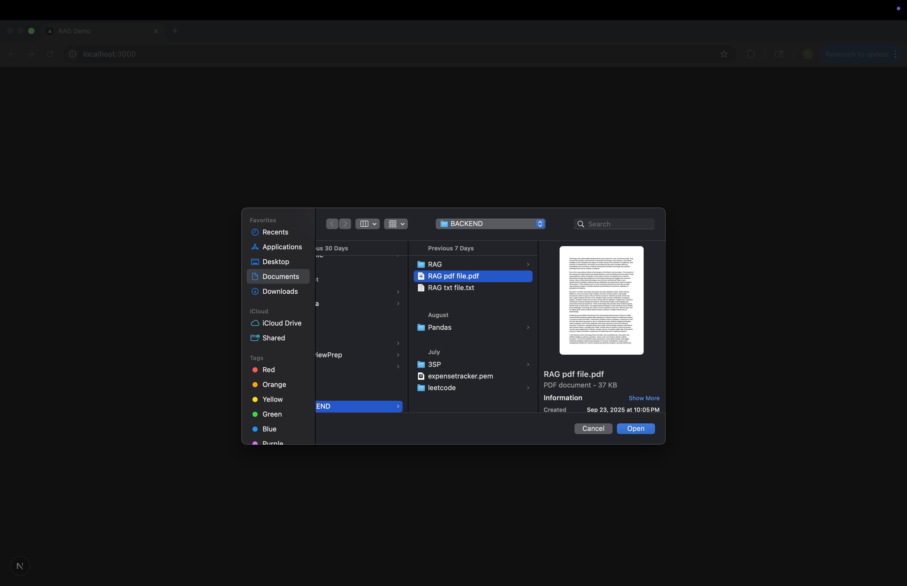
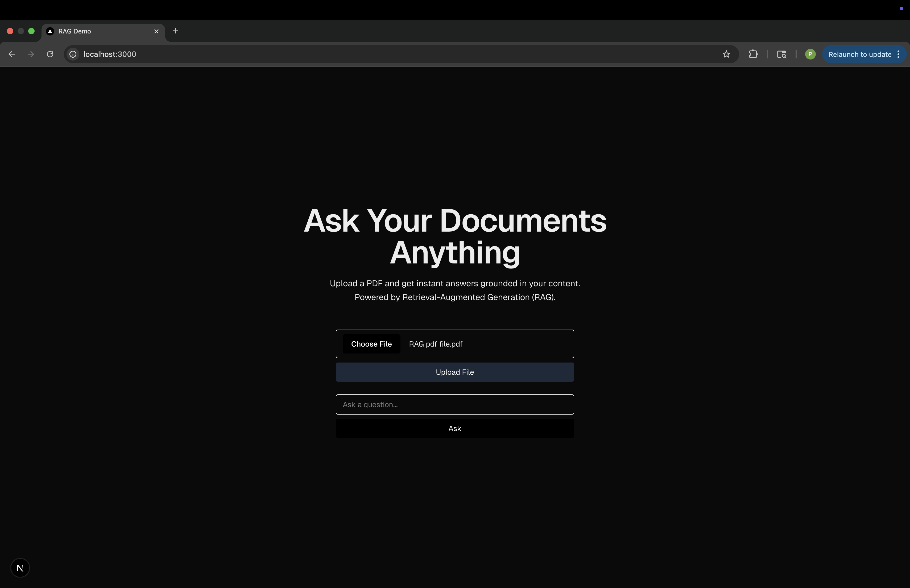
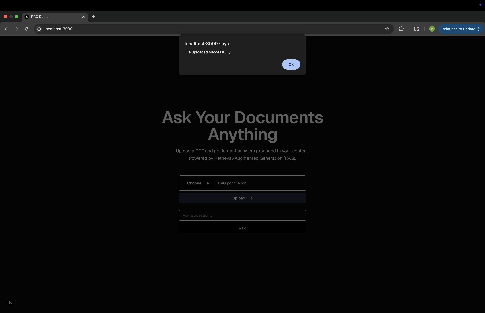
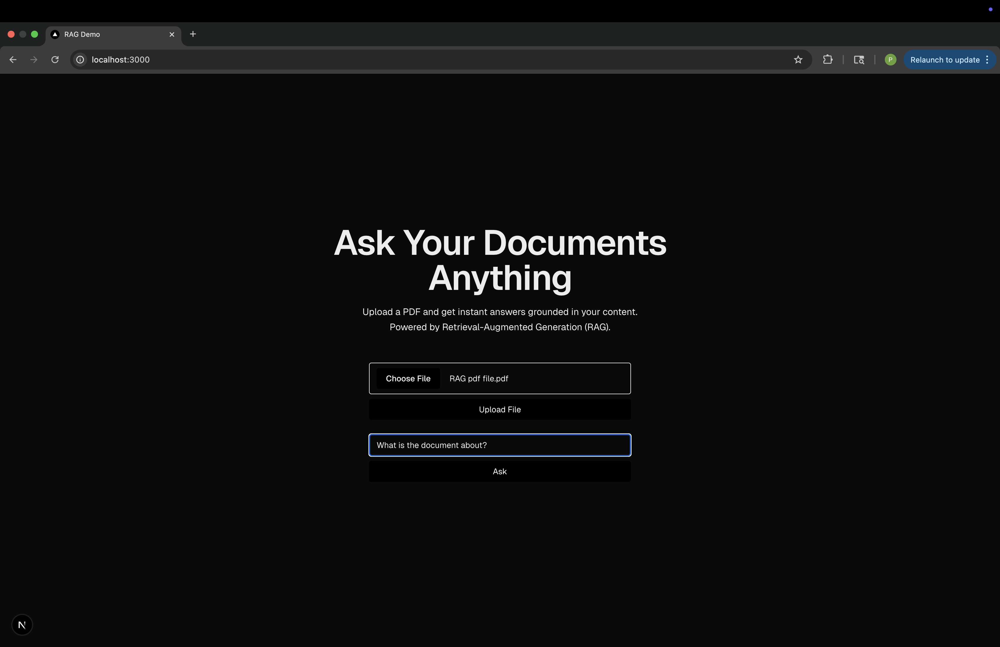
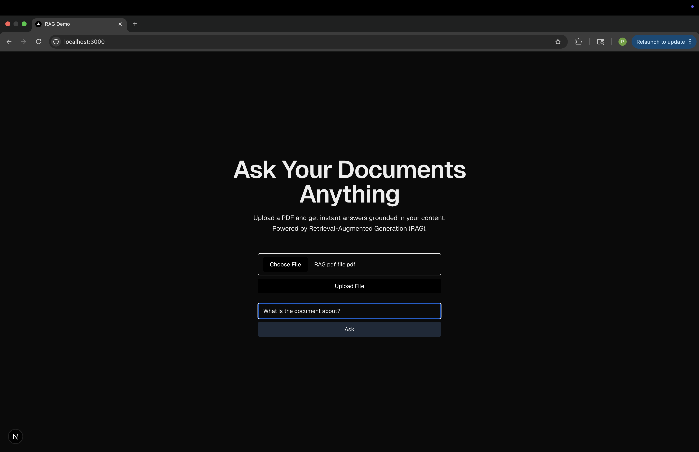
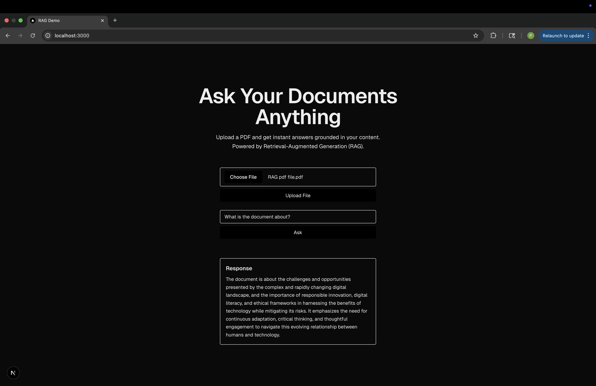

RAG Pipeline — Document Q&A
Overview

This project implements a Retrieval-Augmented Generation (RAG) pipeline for interactive document question answering. Users can upload documents, and the system retrieves relevant text chunks and generates natural language answers using an LLM. The pipeline demonstrates end-to-end semantic search and LLM integration in Python and JavaScript, suitable for scalable document-based applications.

Key features:

Upload and parse PDF/TXT/DOCX files.

Break documents into text chunks and generate embeddings.

Efficient retrieval using FAISS.

Context-aware answer generation via OpenAI GPT-3.5-turbo.

Simple web interface for testing and querying.

Tech Stack

Backend: FastAPI, Python 3.12, FAISS, OpenAI API, Pydantic, dotenv.

Frontend: Next.js, React, TailwindCSS.

Local storage: Uploaded documents saved to uploads/.

Vector database: In-memory FAISS index (embeddings stored per document chunk).

Installation / Local Setup
1. Clone the repository
git clone <your-repo-url>
cd RAG

2. Setup Python environment for backend
python -m venv venv
source venv/bin/activate
pip install -r requirements.txt

3. Setup frontend
cd rag-frontend
npm install

Running Locally
1. Start backend
source ../venv/bin/activate
uvicorn app.main:app --reload

Backend will run at: http://localhost:8000

2. Start frontend
npm run dev

Frontend will run at: http://localhost:3000

3. Upload documents and query

Navigate to http://localhost:3000

Upload your document(s)

Ask questions in the query box

View answers with context

Project Structure
RAG/
├── app/                 # Backend FastAPI app
│   ├── main.py          # Entry point
│   ├── utils/parser.py  # Document parsing, chunking, embeddings
│   └── ...
├── rag-frontend/        # Frontend Next.js app
├── uploads/             # Uploaded documents
├── venv/                # Python virtual environment
├── requirements.txt     # Backend dependencies
└── README.md

Notes / Future Improvements

Persistence: Currently, FAISS index is in-memory; can be persisted for long-term use.

Deployment: Ready for cloud deployment (Render, Railway, EC2) with minimal changes.

Scalability: Can extend to multiple documents, larger LLMs, or cloud vector databases.

# RAG Pipeline Screenshots

### Overview 

### Choose File

### Select and Open

### Click Upload File

### Get Confirmation

### Ask your Question

### Click Ask

### Sample Query Response

